# Blog App

A simple design of a blog app showing users and their posts.

## General description

This is a simple design of a blog app using the Fake API from [JSONPlaceHolder](https://jsonplaceholder.typicode.com/guide/)

The services used in this app are:

- [List users](https://jsonplaceholder.typicode.com/users)
- [List posts by user](https://jsonplaceholder.typicode.com/posts?userId=1)
- [Get photo by id](https://jsonplaceholder.typicode.com/photos/1)

## Functionalities

- List of users
- Search user by email (Search in memory)
- List posts by user
- Show post
- Internationalization (English and Spanish support)

## Libraries used

- [react-native-vector-icons](https://github.com/oblador/react-native-vector-icons)
- [react-navigation](https://reactnavigation.org/docs/getting-started/)
- [react-navigation-stack](https://reactnavigation.org/docs/stack-navigator)
- [react-native-linear-gradient](https://github.com/react-native-linear-gradient/react-native-linear-gradient)
- [react-native-reanimated](https://docs.swmansion.com/react-native-reanimated/docs/fundamentals/installation)
- [Redux Toolkit](https://redux-toolkit.js.org/introduction/getting-started)
- [react-native-dotenv](https://github.com/goatandsheep/react-native-dotenv)
- [react-native-svg](https://github.com/software-mansion/react-native-svg)
- [react-i18next](https://react.i18next.com/getting-started)

## Instructions

- Copy the content of the file **_.env.example_** to a new file called **_.env_**
- Install dependencies
  ```bash
  npm install
  --- or ---
  yarn install
  ```
- Make sure you have your local [development environment configured correctly](https://reactnative.dev/docs/environment-setup).

# Screenshots

| Android                                            | IOS                                        |
| -------------------------------------------------- | ------------------------------------------ |
| 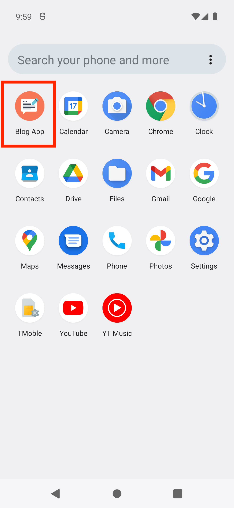        | 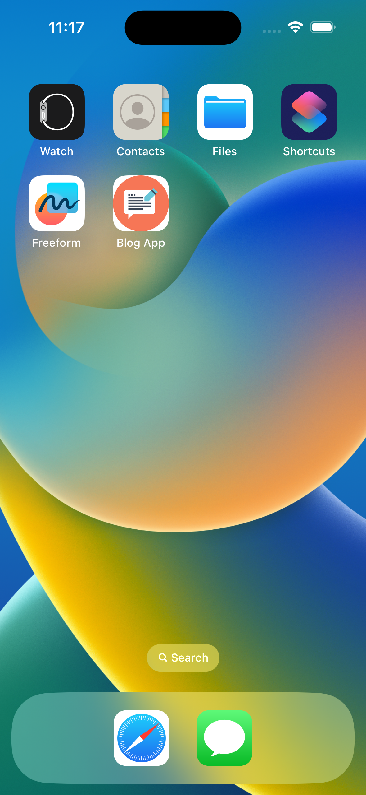        |
| 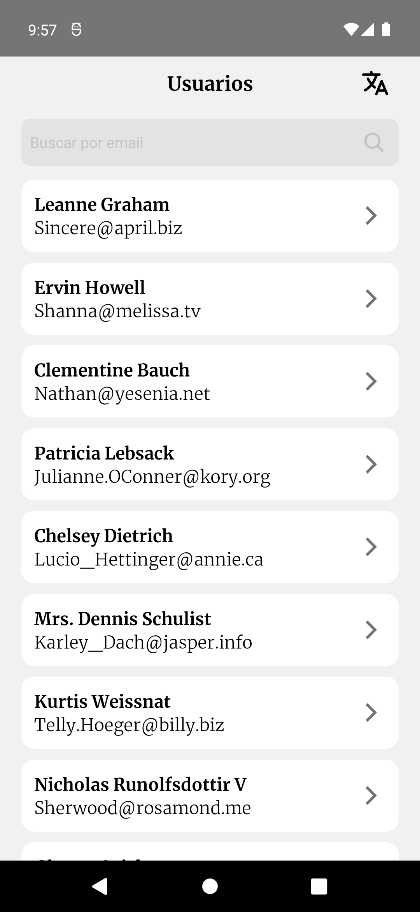            | 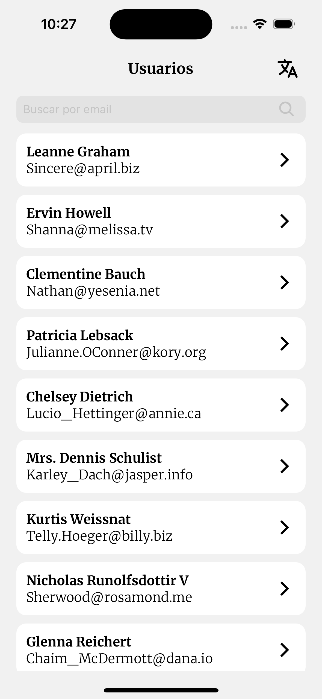            |
| 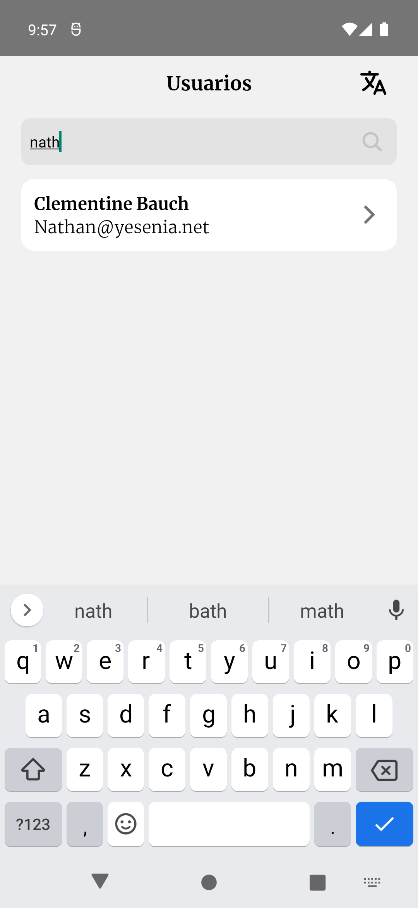  | 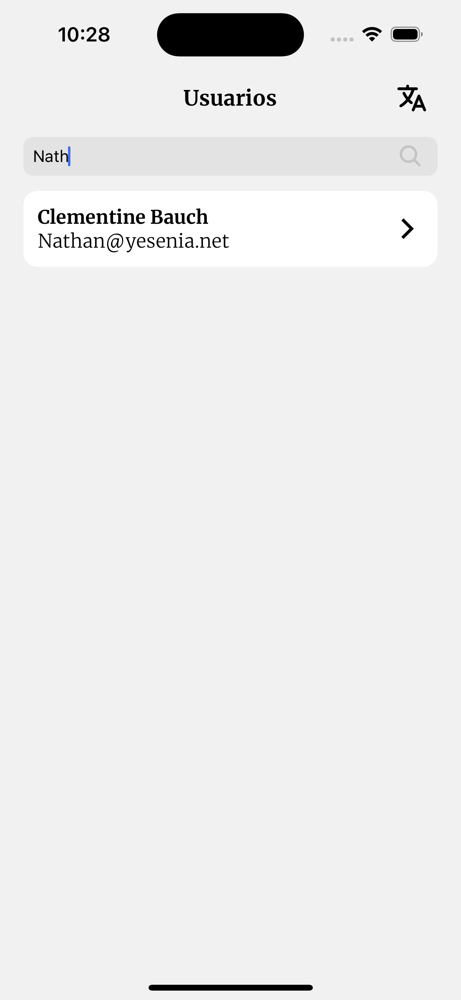  |
| 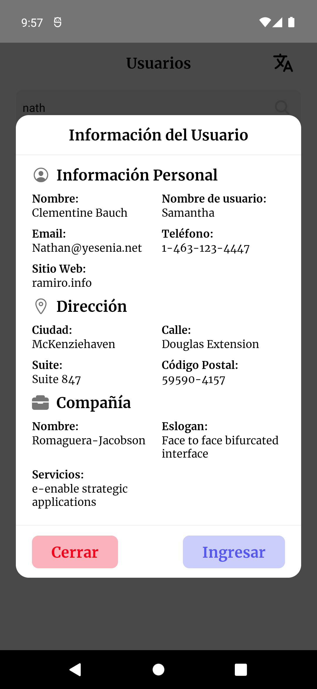        | 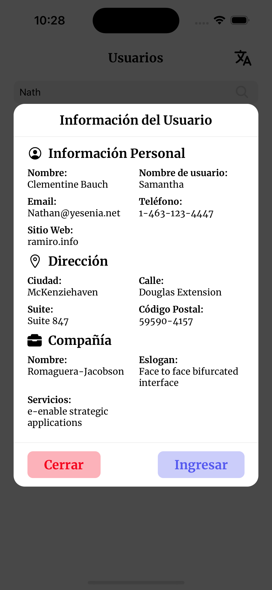        |
| 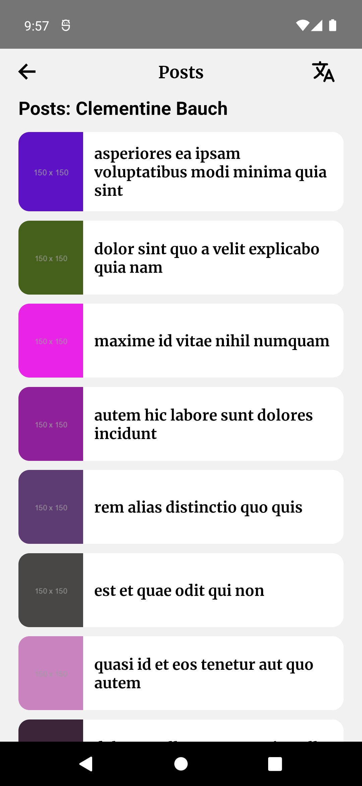    | 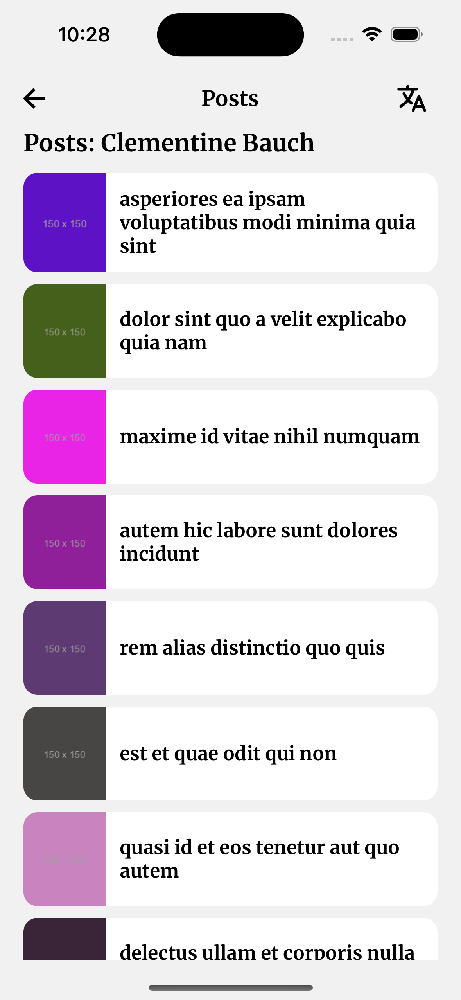    |
| 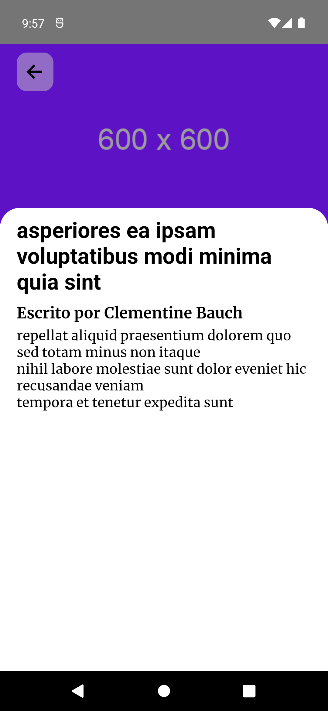        | 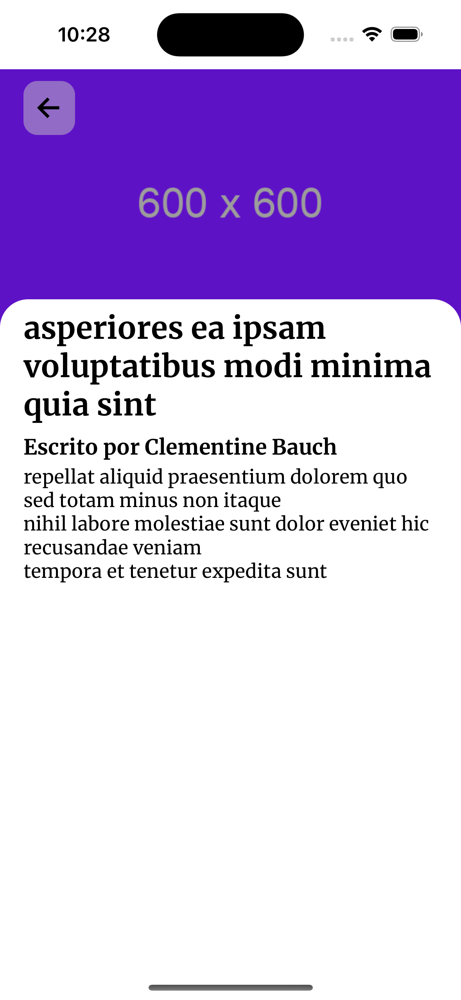        |
| 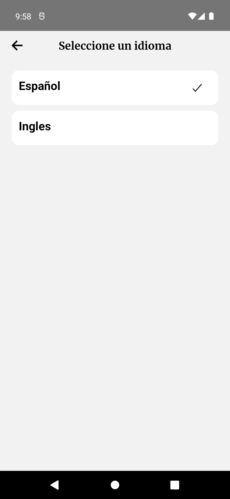 | 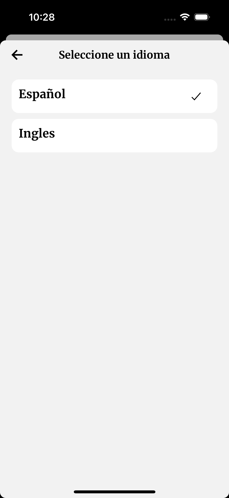 |
