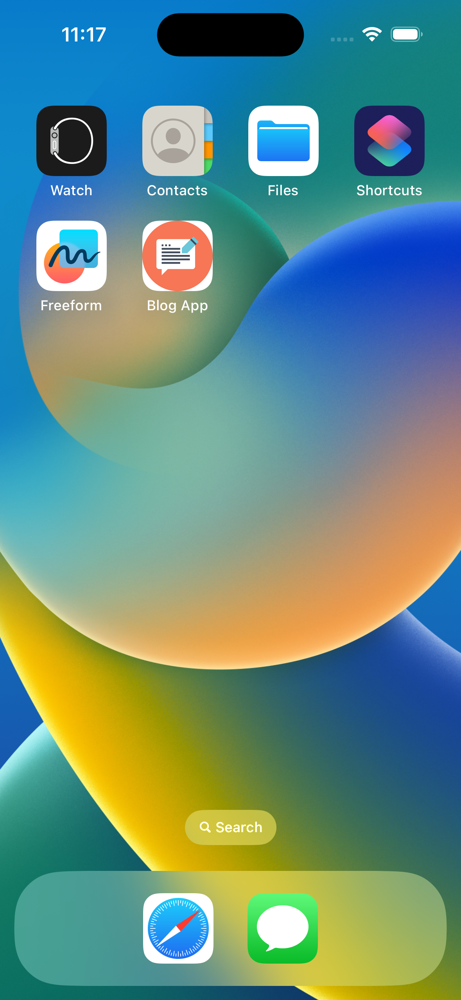
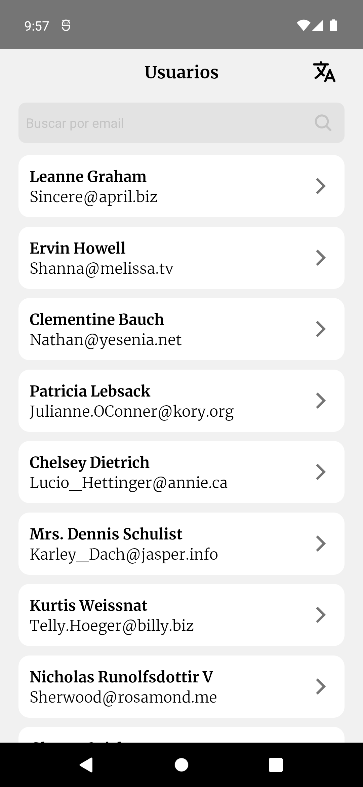
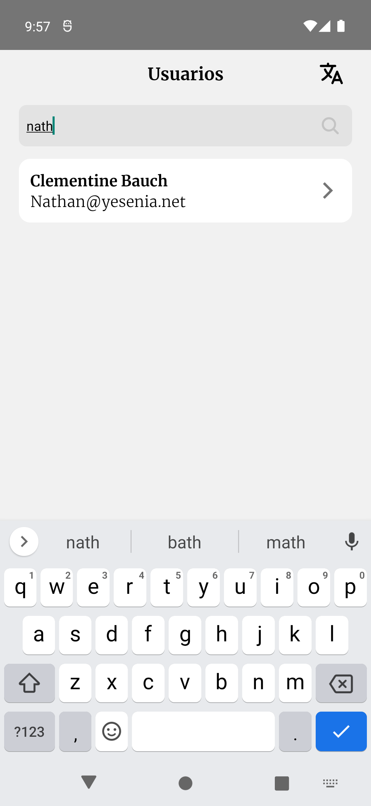
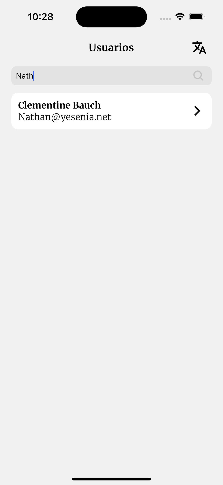
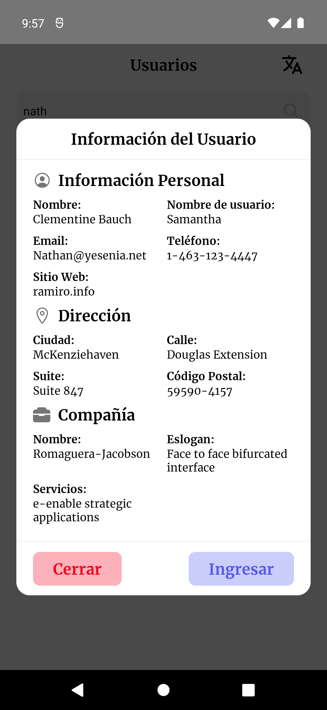
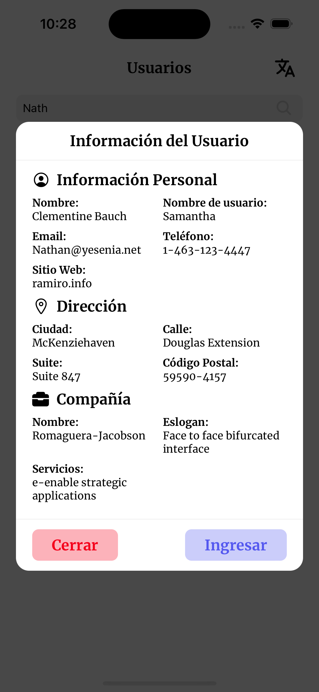
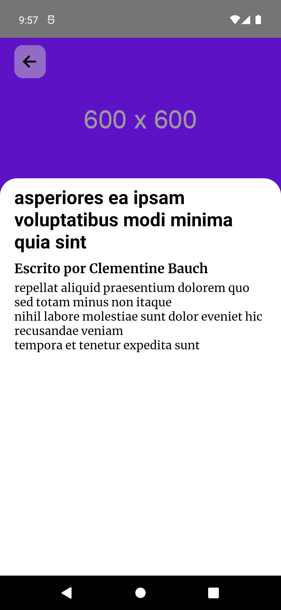
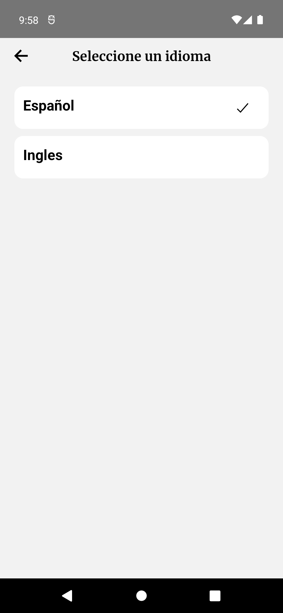
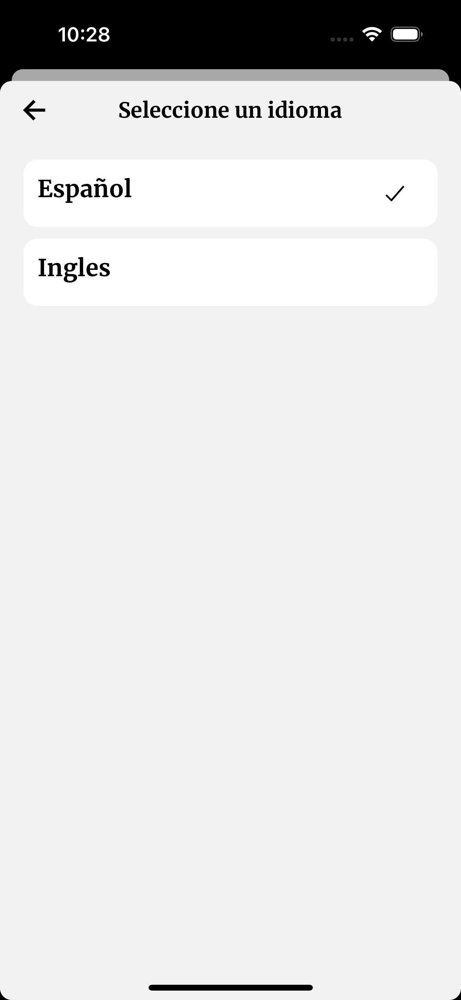

# Blog App

Un simple diseño de una aplicación para un blog mostrando los usuarios y sus posts.

## Descripción general

Este es un diseño de una aplicación para un blog usando la Fake API de [JSONPlaceHolder](https://jsonplaceholder.typicode.com/guide/)

Lo servicios utilizados en esta aplicación son:

- [Listado de usuarios](https://jsonplaceholder.typicode.com/users)
- [Listado de posts por usuario](https://jsonplaceholder.typicode.com/posts?userId=1)
- [Obtener imagen por ID](https://jsonplaceholder.typicode.com/photos/1)

## Funcionalidades

- Listado de usuarios
- Búsqueda de usuarios por email (Búsqueda en memoria)
- Listado de posts por usuario
- Mostrar un post
- Internacionalización (Soporte para Ingles y Español)

## Librerías utilizadas

- [react-native-vector-icons](https://github.com/oblador/react-native-vector-icons)
- [react-navigation](https://reactnavigation.org/docs/getting-started/)
- [react-navigation-stack](https://reactnavigation.org/docs/stack-navigator)
- [react-native-linear-gradient](https://github.com/react-native-linear-gradient/react-native-linear-gradient)
- [react-native-reanimated](https://docs.swmansion.com/react-native-reanimated/docs/fundamentals/installation)
- [Redux Toolkit](https://redux-toolkit.js.org/introduction/getting-started)
- [react-native-dotenv](https://github.com/goatandsheep/react-native-dotenv)
- [react-native-svg](https://github.com/software-mansion/react-native-svg)
- [react-i18next](https://react.i18next.com/getting-started)

## Instrucciones

- Copia el contenido del archivo **_.env.example_** a un nuevo archivo llamado **_.env_**
- Instala las dependencias
  ```bash
  npm install
  --- or ---
  yarn install
  ```
- Asegúrate de tener tu [ambiente de desarrollo local configurado correctamente](https://reactnative.dev/docs/environment-setup).

# Capturas de pantalla

| Android                                            | IOS                                        |
| -------------------------------------------------- | ------------------------------------------ |
|         |         |
|             |             |
|   |   |
|         |         |
|     |     |
|         |         |
|  |  |
